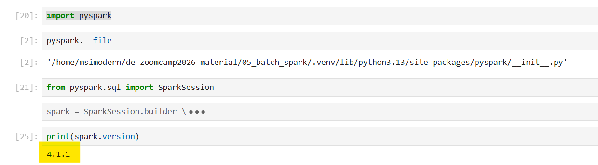
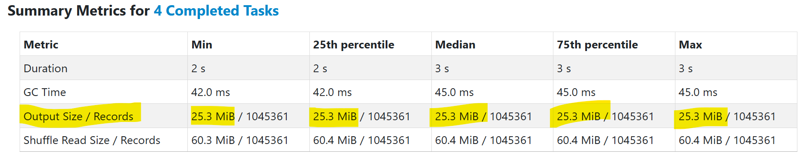
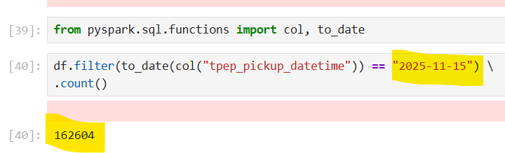
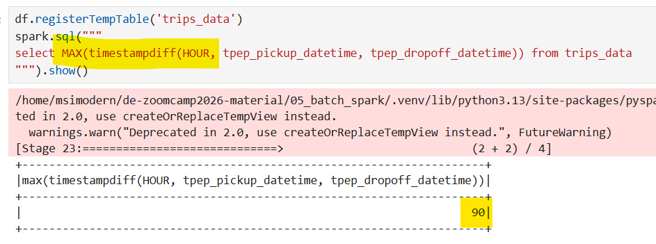
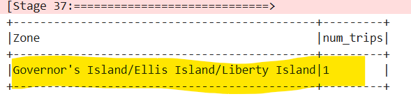

This post is part of a series where I document my learnings from the “Data Engineering Zoomcamp” course, created by DataTalksClub. The course material can be found on GitHub here: [DataTalksClub/data-engineering-zoomcamp: Free Data Engineering course!](https://github.com/DataTalksClub/data-engineering-zoomcamp/tree/main)

In this post, I will dive into the sixth module “Batch Processing”, focusing on an introduction to the fundamentals of batch processing and spark.

All the file to do this task available in other repository, you can check here https://github.com/ananurkaromah/de-zoomcamp2026-material

For this homework we will be using the Yellow 2025-11 data from the official website:

```
!wget https://d37ci6vzurychx.cloudfront.net/trip-data/yellow_tripdata_2025-11.parquet
```
<br>


### **Question 1: Install Spark and PySpark**

- Install Spark
- Run PySpark
- Create a local spark session
- Execute spark.version.

What's the output?

```jsx
import pyspark
from pyspark.sql import SparkSession

spark = SparkSession.builder \
    .master("local[*]") \
    .appName('test') \
    .getOrCreate()

print(spark.version)
```
<br>



<br>

**Answer:  4.1.1**

<br>

### **Question 2: Yellow November 2025**

Read the November 2025 Yellow into a Spark Dataframe.

Repartition the Dataframe to 4 partitions and save it to parquet.

What is the average size of the Parquet (ending with .parquet extension) Files that were created (in MB)? Select the answer which most closely matches.

- 6MB
- 25MB
- 75MB
- 100MB

```jsx
# Read the November 2025 Yellow into a Spark Dataframe.
df = spark.read.parquet('yellow_tripdata_2025-11.parquet')

# Repartition the Dataframe to 4 partitions and save it to parquet.
df = df.repartition(4)
df.write.parquet('yellow/2025/11.parquet')
```



<br>

**Answer: 25 MiB**

<br>

### **Question 3: Count records**

How many taxi trips were there on the 15th of November?

Consider only trips that started on the 15th of November.

- 62,610
- 102,340
- 162,604
- 225,768

```jsx
from pyspark.sql.functions import col, to_date

df.filter(to_date(col("tpep_pickup_datetime")) == "2025-11-15") \
.count()
```
<br>



<br>

**Answer:**   **162,604**

<br>


### **Question 4: Longest trip**

What is the length of the longest trip in the dataset in hours?

- 22.7
- 58.2
- 90.6
- 134.5

``` jsx
df.registerTempTable('trips_data')
spark.sql("""
select MAX(timestampdiff(HOUR, tpep_pickup_datetime, tpep_dropoff_datetime)) from trips_data
""").show()
```
<br>



<br>

**Answer : 90.6**
<br>

### **Question 5: User Interface**

Spark's User Interface which shows the application's dashboard runs on which local port?

- 80
- 443
- 4040
- 8080
<br>

**Answer: 4040**

<br>

### **Question 6: Least frequent pickup location zone**

Load the zone lookup data into a temp view in Spark:

```
!wget https://d37ci6vzurychx.cloudfront.net/misc/taxi_zone_lookup.csv
```

Using the zone lookup data and the Yellow November 2025 data, what is the name of the LEAST frequent pickup location Zone?

- Governor's Island/Ellis Island/Liberty Island
- Arden Heights
- Rikers Island
- Jamaica Bay

If multiple answers are correct, select any

```jsx
zone = spark.read \
    .option("header", "true") \
    .csv('taxi_zone_lookup.csv')

from pyspark.sql.functions import col
zone = zone.withColumn("LocationID", col("LocationID").cast("int"))

zone.registerTempTable('zones')

spark.sql("""
select t2.Zone, count(*) as num_trips from trips_data t1 inner join zones t2 on t1.PULocationID = t2.LocationID
group by t2.Zone
order by num_trips
LIMIT 1
""").show(truncate=False)
```
<br>



<br>

**Answer:  The output shows "Governor's Island/Ellis Island/Liberty Island".**